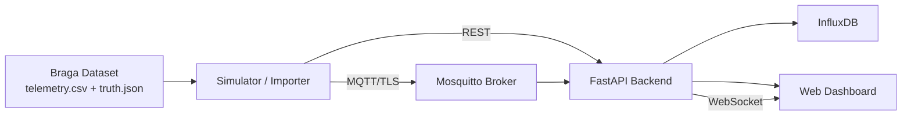

# UrbMobSense: IoT Platform for Urban Micromobility Monitoring

UrbMobSense: IoT Platform for Urban Micromobility Monitoring, focused on scooters and shared bicycles. The platform collects simulated telemetry, processes critical events, persists time series data, exposes a REST API, sends real-time alerts via WebSocket, and provides an operational dashboard.

The case study uses a synthetic, georeferenced dataset from Braga, Portugal, generated over OpenStreetMap road and cycling infrastructure geometry. The dataset enables reproducible validation of normal scenarios and critical scenarios such as falls, sudden braking, congestion, obstacle risk, and data reconciliation at the end of bicycle trips.

## Main Features

- Telemetry ingestion via REST and MQTT/TLS.
- Traffic separation by criticality: routine telemetry vs. operational alerts/events.
- Critical event detection based on GPS, IMU, and ultrasonic sensors.
- Time series data persistence in InfluxDB.
- Web dashboard with fleet status, maps, alerts, sessions, and operational indicators.
- WebSocket for real-time alerts.
- Fleet simulator with synthetic trajectory replay.
- Braga dataset with 100 routes: 50 scooter routes and 50 bicycle routes.
- `dock_data_dump` reconciliation for bicycles to measure completeness of received data.
- Validation scripts, smoke test, and alert latency measurement.

## Architecture



Main components:

- `backend/`: FastAPI API, validation, event detection, MQTT subscriber, and InfluxDB persistence.
- `frontend/` and `index2.html`: web dashboard served by Nginx in the Docker environment.
- `datasets/braga/`: synthetic dataset used for replay and experimental validation.
- `simulate_fleet.py`: continuous fleet simulator.
- `import_dataset.py`: controlled replay of one or more dataset scenarios.
- `deploy/mosquitto/`: MQTT broker configuration with authentication and TLS.
- `k8s-manifests/`: Kubernetes manifests for deploying the stack.
- `ansible/`: supporting playbooks for preparation/deployment.
- `scripts/`: generation, validation, and operational testing.

## Requirements

For local execution with Docker:

- Docker
- Docker Compose

For running Python scripts on the host:

- Python 3.10+
- Dependencies in `backend/requirements.txt`

Optional installation of Python dependencies:

```powershell
python -m pip install -r backend\requirements.txt
```

## Configuration

Create a local `.env` file from the example:

```powershell
Copy-Item env.example .env
notepad .env
```

Before starting the stack, change the sensitive values in `.env`, especially:

- `API_KEY_EDGE`
- `MQTT_USERNAME`
- `MQTT_PASSWORD`
- `INFLUX_USERNAME`
- `INFLUX_PASSWORD`
- `INFLUX_TOKEN`

The `.env` file is ignored by Git and should not be committed. The values in `env.example` are development defaults only.

## Running with Docker Compose

Start the full stack:

```powershell
docker compose up -d --build
```

Check service status:

```powershell
docker compose ps
```

View logs for the main components:

```powershell
docker compose logs -f backend
docker compose logs -f simulator
docker compose logs -f mosquitto
```

Stop the stack:

```powershell
docker compose down
```

Also remove persisted volumes:

```powershell
docker compose down -v
```

## Local Services

Once the stack is running, services are available by default at:

| Service | URL |
| --- | --- |
| Dashboard | `http://localhost:8080/?api_key=<API_KEY_EDGE>` |
| Backend health | `http://localhost:8000/health` |
| Backend readiness | `http://localhost:8000/health/ready` |
| InfluxDB | `http://localhost:18086` |
| MQTT/TLS | `localhost:8883` |

Quick backend check:

```powershell
Invoke-RestMethod http://localhost:8000/health
Invoke-RestMethod http://localhost:8000/health/ready
```

## MQTT/TLS

The Mosquitto broker only exposes MQTT with TLS on port `8883`. Port `1883` should remain closed.

Export the CA certificate generated by the container:

```powershell
docker cp iot-mosquitto:/mosquitto/data/tls/ca.crt .\mosquitto-ca.crt
```

Validate ports:

```powershell
Test-NetConnection localhost -Port 1883
Test-NetConnection localhost -Port 8883
```

## Braga Dataset

The main dataset is located in `datasets/braga/` and contains 100 synthetic routes, each with:

- `telemetry.csv`: time-based samples of the trip.
- `truth.json`: metadata and expected events for validation.

Each subfolder in the dataset represents a different route/path in Braga. Detailed dataset documentation is in `datasets/braga/README.md`.

Dataset validation:

```powershell
python scripts\validate_braga_datasets.py --strict
```

Dataset regeneration:

```powershell
python scripts\generate_braga_datasets.py
```

Force a fresh download of OpenStreetMap data:

```powershell
python scripts\generate_braga_datasets.py --force-osm
```

## Replay and Simulation

Run a dry-run of the importer:

```powershell
python import_dataset.py --mode dry-run
```

Send a scenario via REST:

```powershell
python import_dataset.py --mode rest --api-key <API_KEY_EDGE> --scenario fall_accident_001
```

Send a scenario via MQTT/TLS:

```powershell
python import_dataset.py --mode mqtt --mqtt-tls --mqtt-ca-cert .\mosquitto-ca.crt --mqtt-host localhost --mqtt-port 8883 --mqtt-username <MQTT_USERNAME> --mqtt-password <MQTT_PASSWORD> --scenario fall_accident_001 --publish-truth-alerts
```

Run the local simulator with MQTT/TLS:

```powershell
python simulate_fleet.py --mode mqtt --mqtt-tls --mqtt-ca-cert .\mosquitto-ca.crt --mqtt-host localhost --mqtt-port 8883 --mqtt-username <MQTT_USERNAME> --mqtt-password <MQTT_PASSWORD> --fleet-size 16 --speedup 5 --selection random --publish-truth-alerts
```

Restart only the Docker simulator:

```powershell
docker compose up -d --build simulator
docker compose logs -f simulator
```

## API

All operational endpoints use the key configured in `API_KEY_EDGE`, sent in the `X-API-Key` header.

Examples:

```powershell
Invoke-RestMethod "http://localhost:8000/api/v1/qos/status" -Headers @{"X-API-Key"="<API_KEY_EDGE>"} | ConvertTo-Json -Depth 4
```

```powershell
Invoke-RestMethod "http://localhost:8000/api/v1/sessions/summary?minutos=60" -Headers @{"X-API-Key"="<API_KEY_EDGE>"} | ConvertTo-Json -Depth 4
```

```powershell
Invoke-RestMethod "http://localhost:8000/api/v1/devices/status?minutos=5&offline_after_sec=45" -Headers @{"X-API-Key"="<API_KEY_EDGE>"} | ConvertTo-Json -Depth 5
```

```powershell
Invoke-RestMethod "http://localhost:8000/api/v1/sensors?minutos=10" -Headers @{"X-API-Key"="<API_KEY_EDGE>"} | ConvertTo-Json -Depth 4
```

```powershell
Invoke-RestMethod "http://localhost:8000/api/v1/alerts?minutos=60" -Headers @{"X-API-Key"="<API_KEY_EDGE>"} | ConvertTo-Json -Depth 4
```

Main endpoints:

| Method | Endpoint | Description |
| --- | --- | --- |
| `GET` | `/health` | Basic backend status |
| `GET` | `/health/ready` | Readiness check with InfluxDB |
| `POST` | `/api/v1/sensors` | Telemetry ingestion via REST |
| `GET` | `/api/v1/sensors` | Query recent telemetry |
| `POST` | `/api/v1/alerts` | Manual alert ingestion |
| `GET` | `/api/v1/alerts` | Query recent alerts |
| `GET` | `/api/v1/stats/alerts` | Alert statistics |
| `GET` | `/api/v1/devices` | List of observed devices |
| `GET` | `/api/v1/devices/status` | Operational fleet status |
| `GET` | `/api/v1/devices/{device_id}/latest` | Latest state of a device |
| `GET` | `/api/v1/devices/{device_id}/history` | History of a device |
| `GET` | `/api/v1/sessions/summary` | Simulation session summary |
| `GET` | `/api/v1/qos/status` | MQTT ingestion/QoS status |
| `WS` | `/ws/alerts` | Real-time alerts |

## Running the Backend Locally

To run the backend outside Docker, from the project root:

```powershell
python -m pip install -r backend\requirements.txt
uvicorn app.main:app --app-dir backend --reload --port 8000
```

Ensure the `.env` file exists at the root and that the configured InfluxDB/Mosquitto instances are reachable.

## Tests and Validation

Run unit tests:

```powershell
python -m unittest discover -s tests
```

Validate the dataset:

```powershell
python scripts\validate_braga_datasets.py --strict
```

Run the stack smoke test:

```powershell
python scripts\smoke_test_stack.py --api-key <API_KEY_EDGE>
```

Measure alert latency:

```powershell
python scripts\measure_alert_latency.py --api-key <API_KEY_EDGE>
```

## Kubernetes and Ansible Deployment

The `k8s-manifests/` directory contains manifests for:

- Application namespace.
- Mosquitto with TLS and authentication.
- InfluxDB.
- Backend.
- Dashboard.

The `ansible/` directory contains supporting playbooks for preparation and deployment in a Kubernetes/K3s environment.

Before using these files outside a local environment, review all `Secret` resources and replace development values with real credentials managed outside the repository.

## Security

- Do not commit `.env`, private certificates, tokens, or real passwords.
- Replace all development defaults before any shared or public deployment.
- Use MQTT/TLS and keep port `1883` closed.
- Rotate credentials if any locally used value has been shared or published.
- Prefer external secrets management mechanisms in Kubernetes, CI/CD, and production.

## Attribution

The synthetic Braga trajectories were generated using geometry derived from OpenStreetMap.

Attribution: OpenStreetMap contributors.
